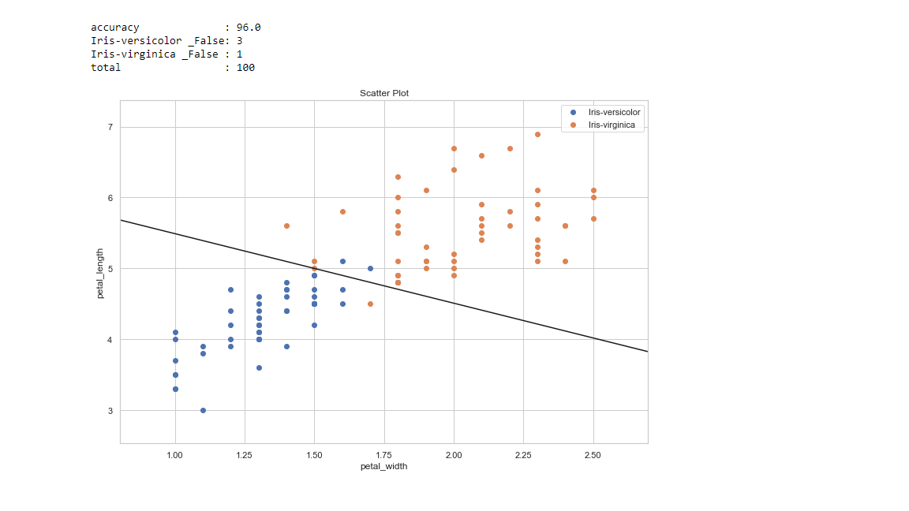

# ML-Classifier-Designing
Linear binary classifier designing for dual feature dataset

The algorithm classification accuracy is comparable  to linear discriminant classifier and linear svm classifier for dual feature dataset.

       
